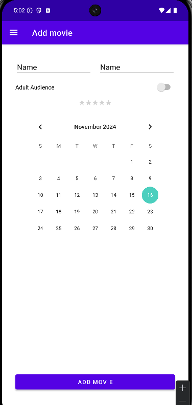

## Zadanie

Waszym zadaniem będzie stworzenie layoutu w pliku __fragment_movies.xml__ i jedynie ten plik nalezy modyfikować.

Do wykonania zadania uzyjcie Constraint Layout.

Nalezy wykorzystać takie komponenty jak:
- Switch
- RatingBar
- Button
- EditText
- CalendarView

Zwróćcie uwagę na odpowiednie relacje pomiędzy poszczególnymi elementami, tj. editTexty powinny być w jednej lini, button powinien być przyklejony do dolnej części ekranu. Wygląd layoutu powinien wyglądać tak jak ten na załączonym obrazku.

Na wykonanie zadania macie 15 minut.

